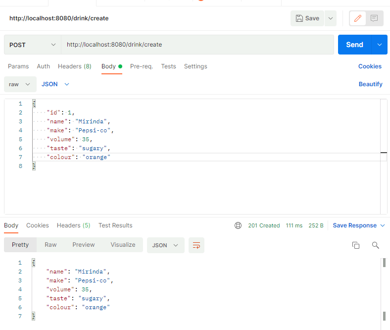
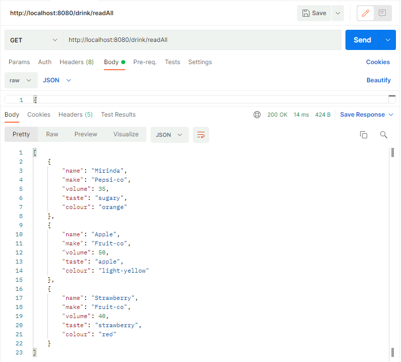
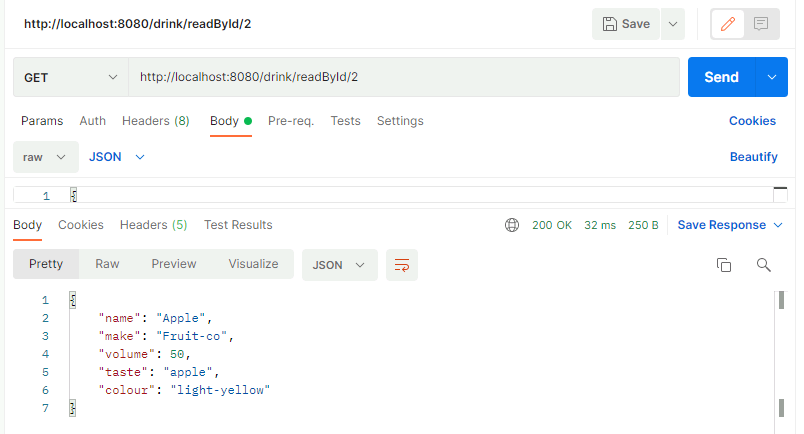
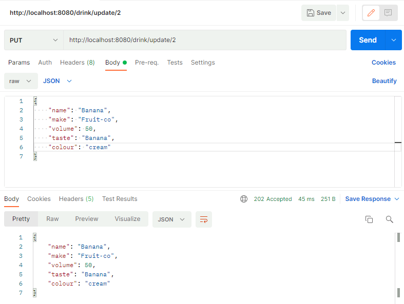
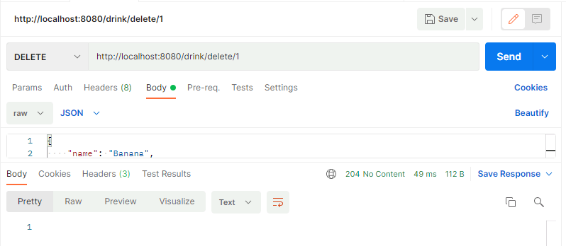
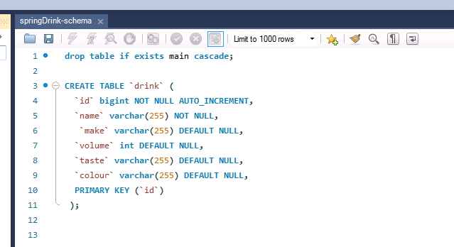
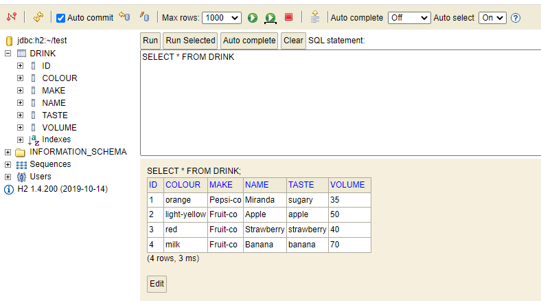
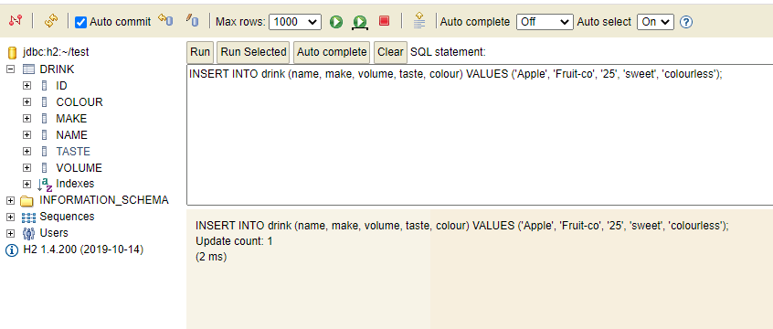
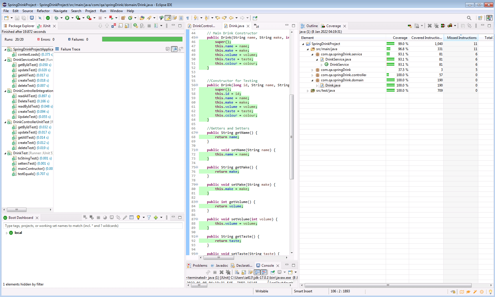

# A Spring Boot Application Back-end with API integration to a Local Database.

# Idris Adebayo

## 10-January-2022

 	

## Project Objective: 
The aim of this project is to develop a simple Spring Boot application which utilises advanced methodologies and technologies for the persistence of data in any field to a remote database for subsequent query when necessary.
The software is written in Java language and has the capacity for the user to store, update, retrieve and delete data on different drinks on a local database. It is integrated with an API which allows online access to this database through series of HTTP requests from a tool called Postman. 
The ability to integrate and store data remotely is fast becoming a must in the present world. Hence, a backend software which can achieve this is quite laudable. In this project, Java programming language (with Spring Boot) has been used due to its versatility and easy of compilation on different computer architectures. 
 
## Scope (How I expected the challenge to go):
From the requirements of the project work, it was clear that several activities would be required to be carried out in the project. These include:
The development of the structure of the code, the features to be included, pushing of each feature of the code onto the github repository, the development of appropriate testing methods for the classes designed in the code, the integration of the code to H2 database and check with postman to ensure data persistence is successful. Finally, the use of agile methodology in the software development.  

## What went well:
The development of the structure of the code was quite fine. The use of Spring Boot also ensured testing folders were already available and ready to be used. Previous learning on the identification of necessary packages needed for an API code, an Agile methodology in software development and sequential pushing of data onto github were all useful.
However, as the code needed to be constantly revisited for improvement and updates, the timeline on the jira board became quite difficult to follow, hence some User Stories previously deemed complete were again revisited to ensure optimal performance of the entire app.

## Possible improvements for future revisions of the project.
It will be helpful for future trainees to be periodically examined while the pace of the training is made more even, with the most relevant modules taught.

## Screenshots of Postman requests and the output from the API
**Postman call to CREATE new drink data**

**Postman call to READ all drink data entries**

**Postman call to READ drink data by their Id**

**Postman call to UPDATE a drink data entry by the Id**

**Postman call to DELETE a drink data entry by the Id**

## Screenshots of database to prove that data is being persisted 
**Screenshot of Table being created on MySQL workbench**

**Screenshot of Drink data being READ on the H2 console**

**Screenshot of Drink data being INSERTED into the Drink Table in the H2 console**

## Sreenshots of Test results, including coverage report

**Link to Jira Board**
https://idristayi1.atlassian.net/jira/software/projects/SPRIN/boards/3/roadmap

